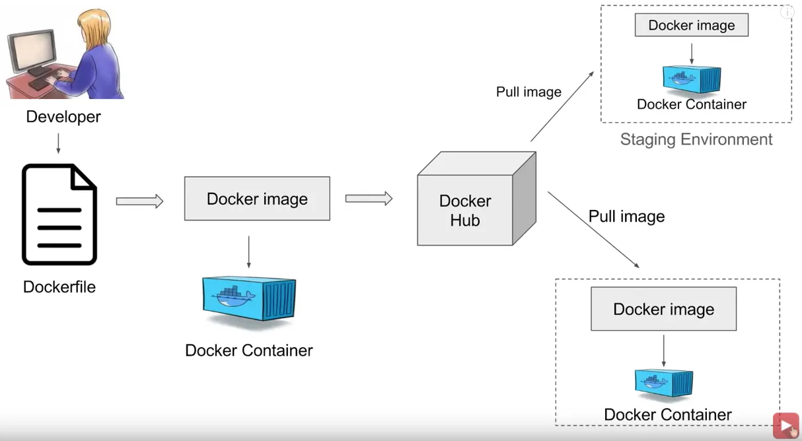

# What is Docker and Why is it Important

Docker is an open-source platform that automates the deployment, scaling, and management of applications within lightweight, portable containers. Containers package an application and its dependencies, ensuring consistency across different environments.

# Why Docker is Important
- Portability: Containers can run consistently across various environments, from a developer's laptop to production servers.
- Efficiency: Containers share the host system's OS, making them more lightweight and faster to start compared to virtual machines.
- Scalability: Docker simplifies scaling applications up or down based on demand.
- Isolation: Containers encapsulate applications, ensuring that dependencies and configurations do not interfere with each other.
- Consistency: Eliminates the "it works on my machine" problem by providing a uniform environment for development, testing, and production.

# Docker workflow


Source: Automation Step by Step-Raghav Pal

# Key Docker Concepts

## Docker Image

A Docker image is a read-only template that contains the instructions to create a Docker container. It includes the application code, runtime, libraries, environment variables, and configuration files.

## Docker Container

A Docker container is a runnable instance of a Docker image. It encapsulates the application and its environment, allowing it to run consistently across different systems.

## Dockerfile

A Dockerfile is a script containing a series of instructions on how to build a Docker image. It specifies the base image, application code, dependencies, and configuration.

## Dockerhub

Docker Hub is a cloud-based repository where Docker users can store and share Docker images. It provides access to a vast library of pre-built images.

## Docker CLI

The Docker Command-Line Interface (CLI) is a tool used to interact with Docker. It allows users to execute commands to manage images, containers, networks, and more.

# Difference between container and image

- Image: Think of it as a recipe for baking a cake.
- Container: The actual cake baked from the recipe.

# Commands

# Docker commands

0. The most important docker command
```bash
docker --help
```

1. Displays Docker version information.
```bash
docker version
```

2. Provides detailed information about the Docker installation.
```bash
docker info
```

3. Downloads a Docker image from a registry.
```bash
docker pull <image>
```

4. Lists all downloaded Docker images.
```bash
docker images
```

5. Creates and starts a container from an image.
```bash
docker run <image>
```

6. Lists running containers.
```bash
docker ps
```

7. Lists all containers, including stopped ones.
```bash
docker ps -a
```

8. Stops a running container.
```bash
docker stop <container>
```

9. Removes a stopped container.
```bash
docker rm <container>
```

10. Removes a Docker image.
```bash
docker rmi <image>
```

11. Executes a command inside a running container.
```bash
docker exec -it <container> <command>
```

12. Builds a Docker image from a Dockerfile in the current directory.
```bash
docker build -t <tag> .
```

13. Starts services defined in a docker-compose.yml file.
```bash
docker-compose up
```

14. Stops and removes containers, networks, images, and volumes created by `docker-compose up`
```bash
docker-compose down
```