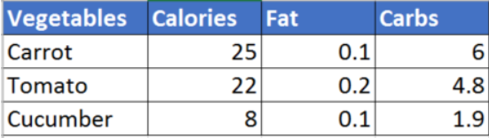
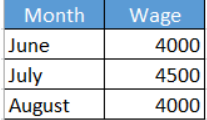

1. Update the 01_food.yml file to add a Vegetable - Carrot.
2. Update the food.yml file to add a list of Vegetables - Carrot, Tomato, Cucumber
3. update the nutrition information for Vegetables. Use the below table for information

4. Jacob is 30 year old Male working as a Systems Engineer at a firm. Represent Jacob's information (Name, Sex, Age, Title) in YAML format. Create a dictionary named Employee and define properties under it.
5. Update the YAML file to represent the Projects assigned to Jacob. Remember Jacob works on Multiple projects - Automation and Support. So remember to use a list.
6. Update the YAML file to include Jacob's pay slips. Add a new property "Payslips" and create a list of pay slip details (Use list of dictionaries). Each payslip detail contains Month and Wage.\

