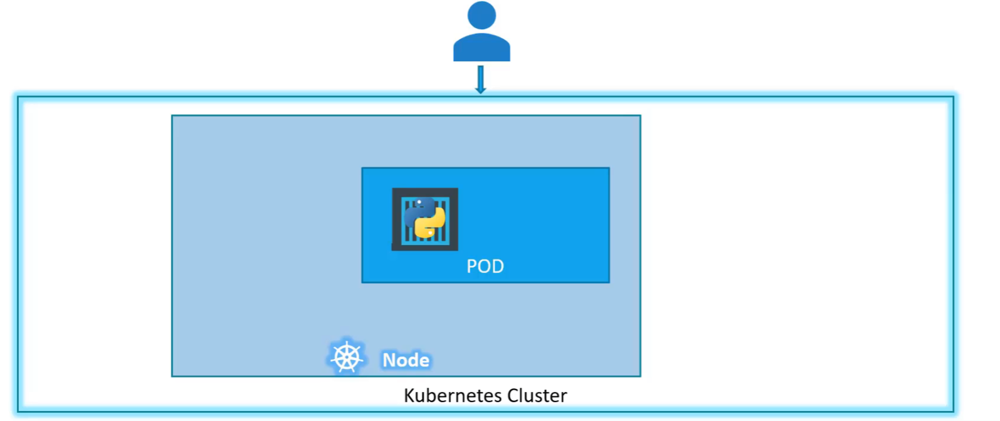
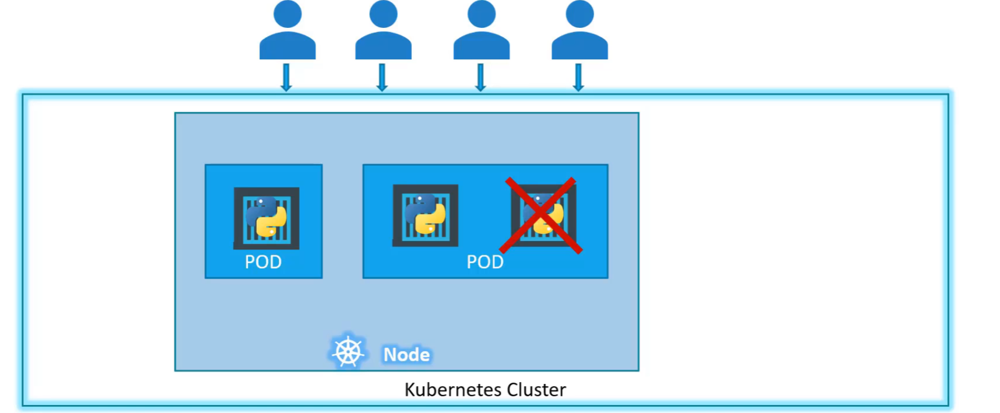
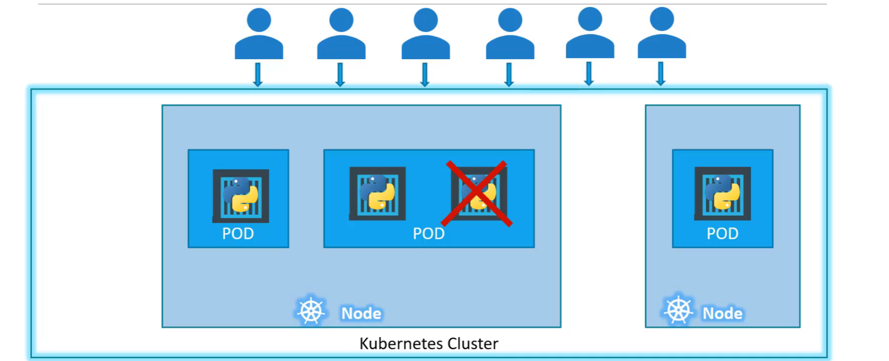
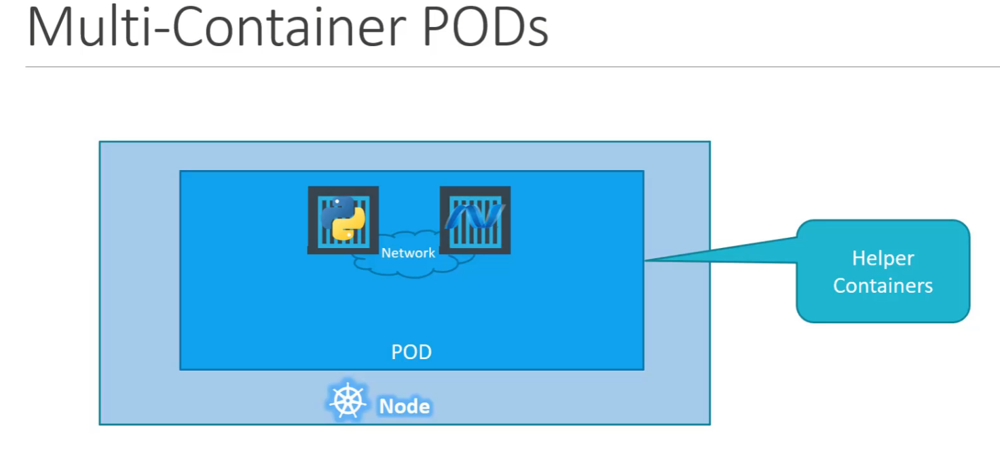

# Core K8s components

## Pods

Kubernetes does not deploy containers directly on worker nodes. The containers are encapsulated into pods.
A pod is the smallest object you can create in k8s.

Simplest example:


Simple example for higher load:


Simple example for higher load and more nodes:


### Multi container pods



### Deploying pods

#### Using yaml files

Kubernetes uses yaml files as inputs for create resources. They have a similar structure.

```yaml
# k8s api version (depends on the created object, for pods it is v1)
apiVersion: v1
# refers to the type of object (example: Pod, Deployment, Service, etc)
kind: Pod
# data about the object (example: name, labels, namespace)
metadata:
  name: <podname>
#
spec:
  containers:
    - name: <name of the container>
      image: <name of the docker image>
```

After that you can create the resource using the

```shell
kubectl create -f <filename>
```

We can list the created pods (or any other resources) with the following command:

```shell
kubectl get <resource>
```

For a more detailed output we can use

```shell
kubectl get <resource> -o wide
```

We can also get the details about a running pod

```shell
kubectl describe pod <podname>
```

If we want the inspect the yaml representation of a created object we can use

```shell
kubectl get pod <podname> -o yaml
```

#### Using imperative commands

##### Create a new pod

```shell
kubectl run <podname> --image <docker imagename>
```

##### Dry-run

If we want to check the pod(or any other resource) without creating it we can use

```shell
kubectl run <podname> --image <docker imagename> --dry-run=client -o yaml
```