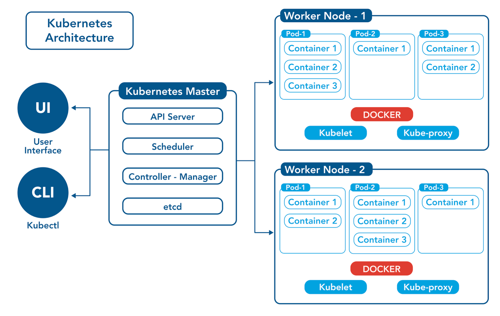

# What is kubernetes?

Kubernetes (often called “K8s”) is an open-source system for managing and orchestrating containers. Think of containers as lightweight, portable boxes that bundle your application and everything it needs to run (like libraries and dependencies). Kubernetes helps you easily run many of these containers across a group of computers (a cluster) while ensuring that:

- Applications stay up and running.
- Workloads can scale up or down automatically.
- Updates can be rolled out without taking everything down.

# Why is Kubernetes important & What problems does it solve?

## Scalability

If your application needs more resources because of increased traffic, Kubernetes can automatically spin up additional containers. When things slow down, it can scale back down.

## High Availability

Kubernetes can detect when a container or a node (machine) goes down and replace it, ensuring your application stays online.

## Portability & Flexibility

You can deploy your containers to different environments—your own servers, cloud providers like AWS, Azure, or Google Cloud—without rewriting everything.

## Self-Healing

If something fails (for example, a container crashes), Kubernetes restarts it automatically.

## Rolling Updates

You can update your application in stages without downtime. If something goes wrong, Kubernetes can roll back to the previous version.

# Kubernetes architecture

Source: [OpsRamp](https://www.opsramp.com/guides/why-kubernetes/kubernetes-architecture/)

# Key Kubernetes components

A Kubernetes cluster typically has two types of machines:

- Control Plane (Master) components — the “brain” of the cluster.
- Worker Node components — the machines that actually run your containerized applications.

## Control Plane (Master Node)

### kube-apiserver

- The front door or gateway to Kubernetes.
- All requests (from users or internal components) flow through this API server.
- Validates requests and updates the cluster state (by talking to etcd and other components).

### etcd

- A key-value store that holds the cluster’s state (e.g., what deployments exist, which pods are running).
- Highly consistent and distributed, ensuring critical data (like config and states) is stored reliably.

### kube-scheduler

- Decides which worker node a new pod should run on, based on resources, policies, and constraints.

### kube-controller-manager

Runs a set of controller processes that watch the cluster state and make changes to move the cluster toward the desired state. Examples include

- Replication Controller: Ensures the correct number of pod replicas.
- Node Controller: Handles node health checks.
- Endpoint Controller: Manages endpoint objects that link services to pods.

## Worker Node Components

### kubelet

- The agent running on each worker node.
- Listens to the control plane and manages containers on its node.
- Ensures the containers defined in a PodSpec are running and healthy.

### kube-proxy

- Manages networking for the worker node.
- Maintains network rules and handles traffic routing to correct pods based on Kubernetes services.

### Container Runtime

- The software that actually runs containers. Common examples are Docker, containerd, and CRI-O.
- Kubernetes uses this to start, stop, and manage the containers.
