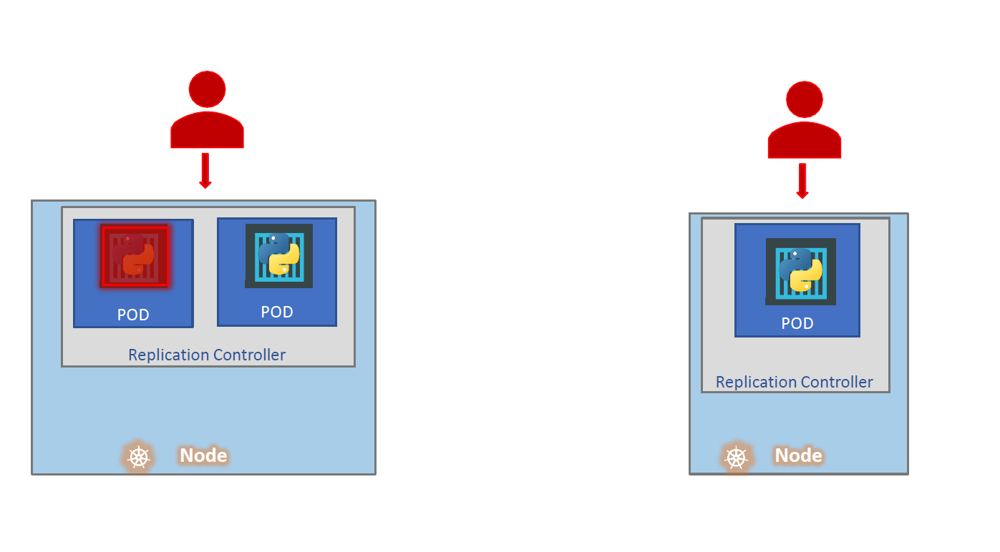
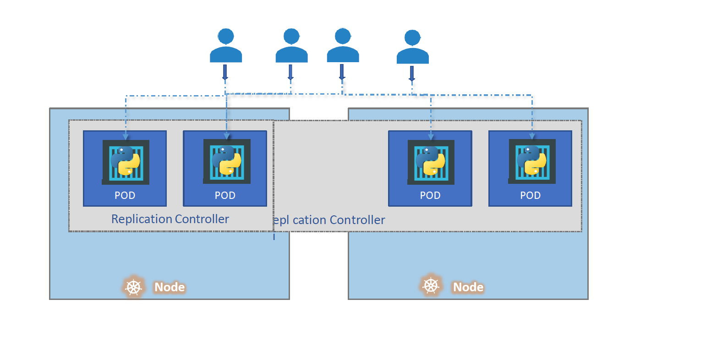
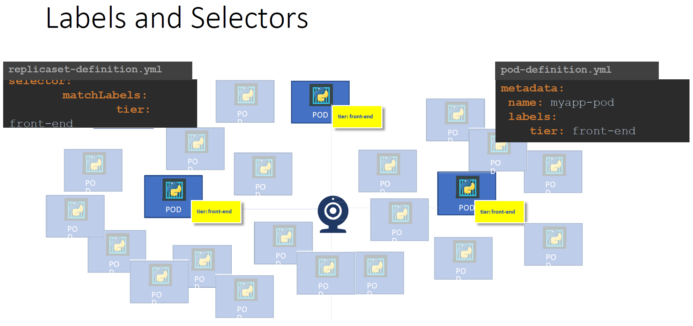
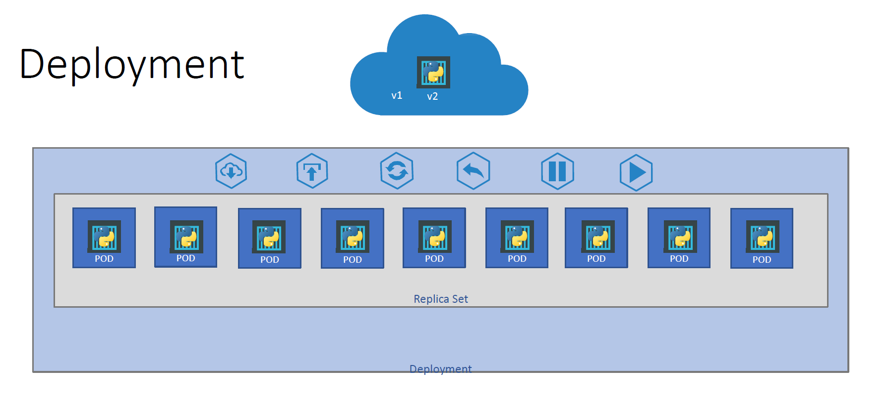
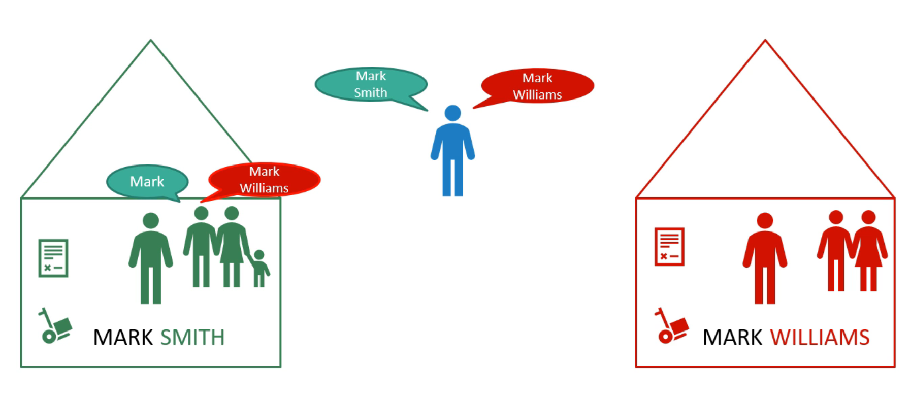

# Core K8s components

## Replica Sets

Replica Sets helps us to run multiple instances of a single Pod -> providing HA (Hight Availability)


We can use it for Load balancing and scaling


Why are the labels important?


### Deploying replica sets

#### Using yaml files

```yaml
apiVersion: apps/v1
kind: ReplicaSet
metadata:
  name: <replicasetname>
spec:
  replicas: <desired count of replicas>
  selector:
    matchLabels: <labels of the pod>
  template:
    metadata:
      labels: <labels of the pod>
    spec:
      containers:
        - name: <containername>
          image: <imagename>
```

#### Using imperative commands

You can not create replicaset imperatively.

## Deployments

- Whenever we deploy a new version of our application in a production environment, we want it to be installed seamlessly. We do not want any downtime (i.e., when zero instances of our application are running), so we update our instances one after another. This is called a rolling update.
- If the new version of the application contains an error, we want to roll back the changes.

The deployment resource provides both rolling update and rollback capabilities.




### Deploying deployments

#### Using yaml files

```yaml
apiVersion: apps/v1
kind: Deployment
metadata:
  name: <replicasetname>
spec:
  replicas: <desired count of replicas>
  selector:
    matchLabels: <labels of the pod>
  template:
    metadata:
      labels: <labels of the pod>
    spec:
      containers:
        - name: <containername>
          image: <imagename>
```

## Namespaces

There is a default namespace called `default`.\
We can create our own namespaces (for example for dev or prod environment)\
Each namespace can have its own set of policies and a quoate of resources (ram, cpu)

### Analogy



### Commands

```shell
# list pods in the default namespace
kubectl get pods
# list pods in a specific namespace
kubectl get pods --namespace=<my-namespace>
# create a namespace
kubectl create namespace <my-namespace>
```

#### Using yaml files
```yaml
apiVersion: v1
kind: Namespace
metadata:
  name: <my-namespace>
```
