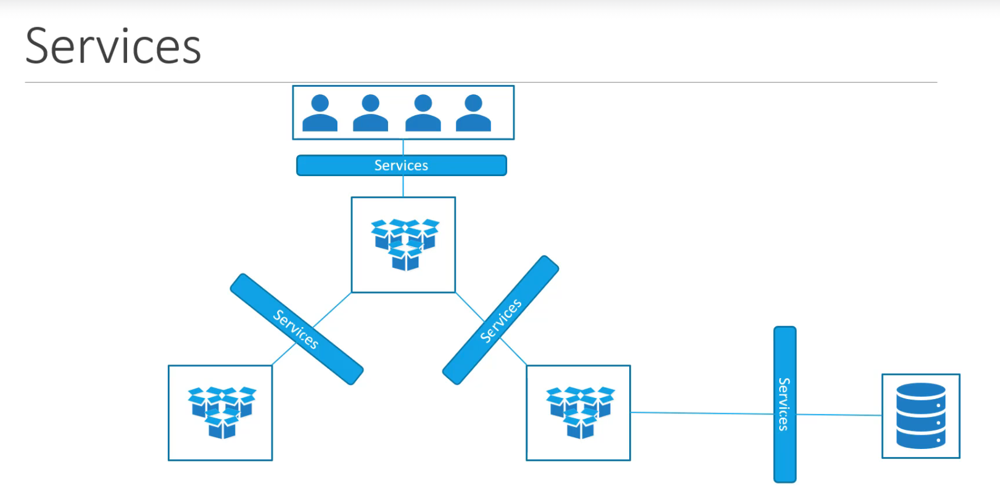
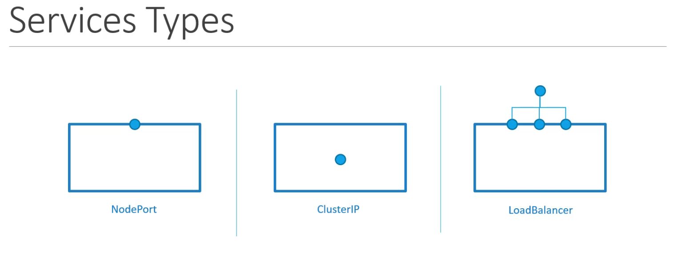
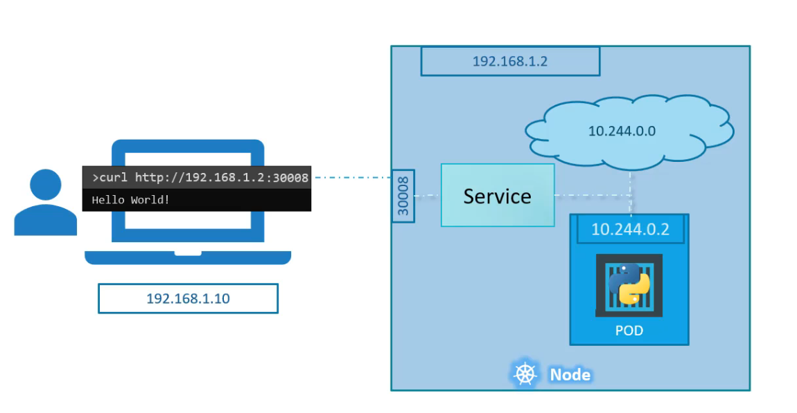
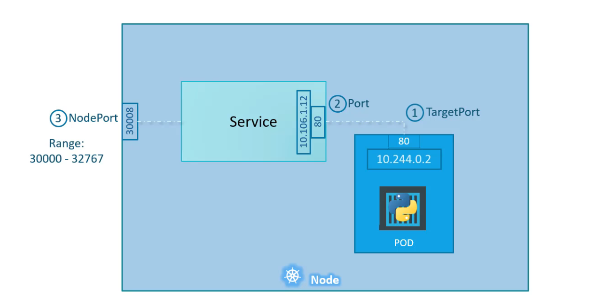
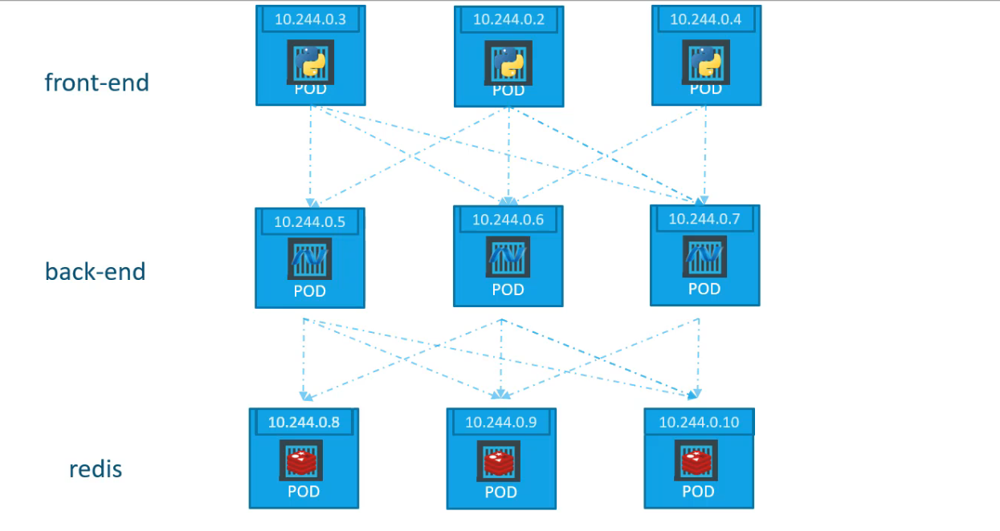
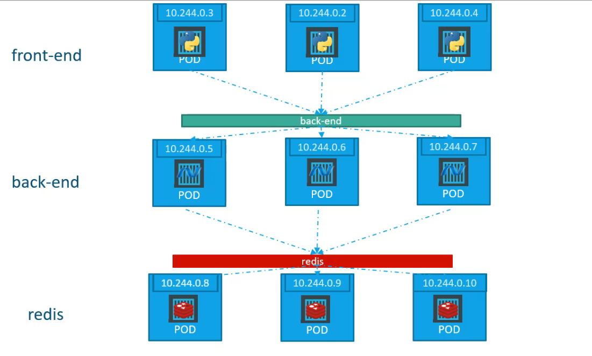
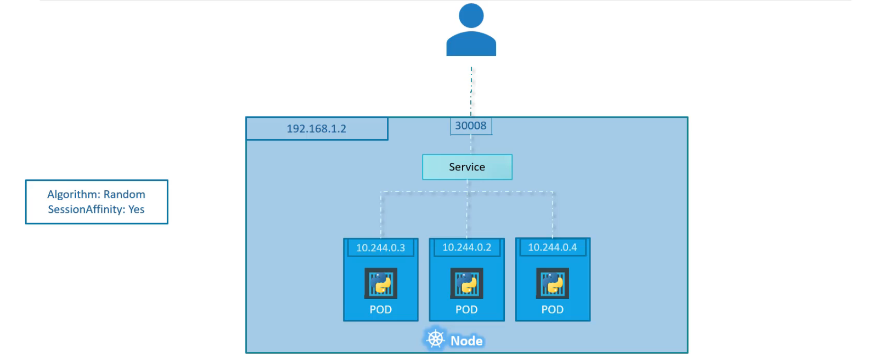
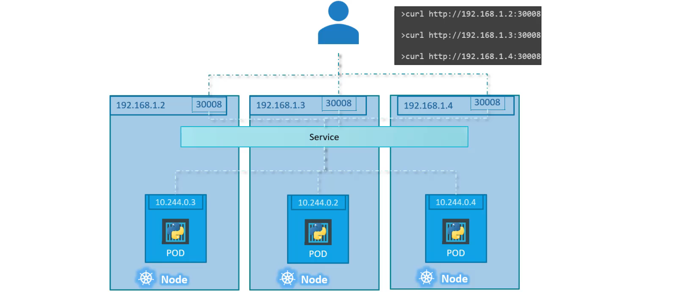

# Kubernetes Services

Kubernetes Services enable communication between components within and outside of the cluster.
It helps us connect applications together with other applications or users(end users).



## Type of Services



### Node Port Service

The service makes an internal port accessible on a port on the node (enables external access).



There are 3 Ports involved (from the point of view of the service):

- TargetPort
- Port
- NodePort (30000-32767)



### Cluster Ip

The service creates a virtual IP inside the cluster to enable communication between different services using only this IP.

Example of a typical application:\




## Load Balancing

If there are more than one pod for a given label set, then all matching pods will be selected.




## Commands

```shell
# List all services in default namespace
kubectl get services
# List all services in default namespace (short form)
kubectl get svc
# Get informations about a service
kubectl describe svc <SERVICE_NAME>
# List all services in a specific namespace
kubectl get svc -n <NAMESPACE_NAME>
# Get informations about a service in a specific namespace
kubectl describe svc <SERVICE_NAME> -n <NAMESPACE_NAME>
# Call a service from an another Pod in the same namespace
kubectl run temp -it --restart=Never --rm=true --image=nginx -- /bin/sh
curl <SERVICE_NAME>:<SERVICE_PORT>/<PATH>
# Call a service from an another Pod in another namespace
kubectl run temp -it --restart=Never --rm=true --image=nginx -- /bin/sh
curl <SERVICE_NAME>.<NAMESPACE_NAME>.svc.cluster.local:<SERVICE_PORT>/<PATH>
```

## Creating services

### Using yaml files

```yaml
apiVersion: v1
kind: Service
metadata:
  name: <SERVICE_NAME>
spec:
  type: <SERVICE_TYPE> #NodePort, ClusterIP or LoadBalancer
  ports:
    - targetPort: <POD_PORT>
      port: <SERVICE_PORT>
      nodePort: <NODE_PORT> # valid Range: 30000-32767
  selector:
    #Labels of the Pod
```

### Using imperative commands

```shell
#using kubectl create command

#using kubectl expose command
kubectl expose deployment <DEPLOYMENT_NAME> --port=<SERVICE_PORT> --target-port=<POD_PORT>
```
