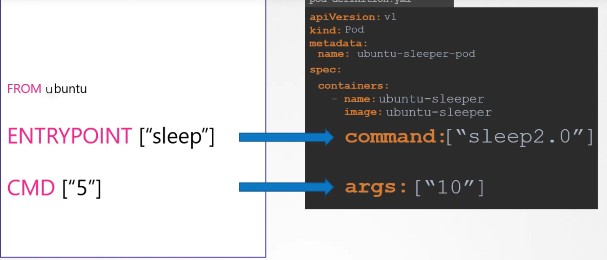

# Recap: Commands and Entrypoints in Docker

[Run vs CMD vs ENTRYPOINT](https://dev.to/kittipat1413/docker-run-vs-cmd-vs-entrypoint-demystifying-the-differences-2a4p)

Containers are meant to run a specific task or process. For example to run a webserver, host a database or to calculate something. Once the task is completed the container exits.\
Who defines what process is run in the container?

There are multiple ways\

1. Using `CMD` in Dockerfile

```shell
CMD ["executable", "arg1", ... "argn"]
CMD ["sleep", "5"] #NOTE: do not specify the command(executable) and arguments together CMD["sleep 5"]
```

You can override this command when creating the container

```shell
docker run <IMAGE_NAME> <COMMAND>
docker run ubuntu echo "Hello World!"
```

What if I want to run always the `sleep` command? We can build a new image

```Docker
FROM ubuntu
CMD ["sleep", "5"]
```

But what if we want to override only the argument for the `sleep` command?

2. Using `ENTRYPOINT`

```shell
ENRTRYPOINT ["executable"]
```

```Docker
FROM ubuntu
ENTRYPOINT ["sleep"]
```

```shell
docker run ubuntu-sleeper 10 #Command at Startup: sleep 10
docker run ubuntu-sleeper #Command at Startup: sleep -> Error
```

What if we want to have default parameters for the entrypoint?

3. Using `ENTRYPOINT` and `CMD` together

```shell
ENTRYPOINT ["executable"]
CMD ["defaultarg1", ... "defaultargn"]
```

```Docker
FROM ubuntu
ENTRYPOINT ["sleep"]
CMD ["5"]
```

```shell
docker run ubuntu-sleeper 10 #Command at Startup: sleep 10
docker run ubuntu-sleeper #Command at Startup: sleep 5
```

# Kubernetes Commands and Arguments

The docker image `kindjozsef/ubuntu-sleeper3` sleeps for a given number of seconds.
By default it sleeps for 5 seconds but you can override it by specifying a command line argument.

```shell
docker run kindjozsef/ubuntu-sleeper3 #sleeps for 5 seconds by default
docker run kindjozsef/ubuntu-sleeper3 10 #sleeps for 10 seconds
```

We can create a pod from this image

```yaml
apiVersion: v1
kind: Pod
metadata:
  name: ubuntu-sleeper-pod
spec:
  containers:
    - image: kindjozsef/ubuntu-sleeper3
      name: ubuntu-sleeper
      args: ["10"] #Corresponds to CMD in Dockerfile
      command: ["echo"] #Corresponds to Entrypoint in Dockerfile
```



# Kubernetes and Docker environment variables

Environment variables in Docker allow you to configure container settings at runtime without modifying the container image. They are especially useful for tailoring applications to different environments and securely managing sensitive data like credentials.

In Kubernetes you can simply set an environment variable in pod/deployment definition file

You can directly set the value of an environment variable:

```yaml
apiVersion: v1
kind: Pod
metadata: pod-name
spec:
  containers:
    - image: <IMAGE_NAME>
      name: <CONTAINER_NAME>
      env:
        - name: <ENV_VARIABLE_1_NAME>
          value: <ENV_VARIABLE_1_VALUE>
        - name: <ENV_VARIABLE_2_NAME>
          value: <ENV_VARIABLE_2_VALUE>
        ...
        - name: <ENV_VARIABLE_N_NAME>
          value: <ENV_VARIABLE_N_VALUE>
```

You can use a configmap as input:

```yaml
apiVersion: v1
kind: Pod
metadata: pod-name
spec:
  containers:
    - image: <IMAGE_NAME>
      name: <CONTAINER_NAME>
      env:
        - name: <ENV_VARIABLE_1_NAME>
          valueFrom:
            configMapKeyRef:
              name: <CONFIGMAP_NAME>
              key: <KEYNAME_IN_CONFIG_MAP>
```

You can use a secret as input:

```yaml
apiVersion: v1
kind: Pod
metadata: pod-name
spec:
  containers:
    - image: <IMAGE_NAME>
      name: <CONTAINER_NAME>
      env:
        - name: <ENV_VARIABLE_1_NAME>
          valueFrom:
            secretKeyRef:
              name: <SECRET_NAME>
              key: <KEYNAME_IN_SECRET_MAP>
```

You can use all variables from a configmap/secret:

```yaml
apiVersion: v1
kind: Pod
metadata: pod-name
spec:
  containers:
    - image: <IMAGE_NAME>
      name: <CONTAINER_NAME>
      envFrom:
        - secretRef:
            name: <SECRET_NAME>
        - configMapRef:
            name: <CONFIGMAP_NAME>
```

# ConfigMaps

ConfigMaps are used to pass configuration data in the form of key value pair in Kubernetes.
There are 2 phases:

- creating the ConfigMap
- injecting the ConfigMap in Pod

## Creating ConfigMaps

### Imperative

```shell
kubectl create configmap <CONFIGMAP_NAME> --from-literal=<key-1>=<value-1> --from-literal=<key2>=<value-2>
# Or you can use a property file
kubectl create configmap <CONIGMAP_NAME> --from-file=<FILE_NAME>
# In the filename you need to define the <KEY>=<VALUE> pairs
# Example:
# KEY1=VALUE1
# KEY2=VALUE2
```

### Declarative

```yaml
apiVersion: v1
kind: ConfigMap
metadata:
  name: <CONFIGMAP_NAME>
data:
  <KEY_1>: <VALUE_1>
  <KEY_2>: <VALUE_2>
  ...
  <KEY_N>: <VALUE_N>
```

## Injecting it in pods

```yaml
apiVersion: v1
kind: Pod
metadata: pod-name
spec:
  containers:
    - image: <IMAGE_NAME>
      name: <CONTAINER_NAME>
      envFrom:
        - configMapRef:
            name: <CONFIGMAP_NAME>
```

```yaml
apiVersion: v1
kind: Pod
metadata: pod-name
spec:
  containers:
    - image: <IMAGE_NAME>
      name: <CONTAINER_NAME>
      env:
        - name: <ENV_VARIABLE_1_NAME>
          valueFrom:
            configMapKeyRef:
              name: <CONFIGMAP_NAME>
              key: <KEYNAME_IN_CONFIG_MAP>
```

# Secrets

It is not a good idea to hardcode sensitive data in application code.
ConfigMaps store configuration data in plain text format.
Secrets are used to store sensitive data in encoded (not encrypted) form.

## Creating Secrets

### Imperative

```shell
kubectl create secret generic <SECRET_NAME> --from-literal=<key-1>=<value-1> --from-literal=<key2>=<value-2>
# Or you can use a property file
kubectl create secret generic <SECRET_NAME> --from-file=<FILE_NAME>
# In the filename you need to define the <KEY>=<VALUE> pairs
# Example:
# KEY1=VALUE1
# KEY2=VALUE2
```

### Declarative

```yaml
apiVersion: v1
kind: Secret
metadata:
  name: <SECRET_NAME>
data:
  <KEY_1>: <ENCODED_VALUE_1>
  <KEY_2>: <ENCODED_VALUE_2>
  ...
  <KEY_N>: <ENCODED_VALUE_N>
```

You can use `base64` to encode/decode data.

```shell
echo "Hello World" | base64 #prints SGVsbG8gV29ybGQK
echo "SGVsbG8gV29ybGQK" | base64 #prints Hello World
```

## Injecting it in pods

```yaml
apiVersion: v1
kind: Pod
metadata: pod-name
spec:
  containers:
    - image: <IMAGE_NAME>
      name: <CONTAINER_NAME>
      envFrom:
        - secretRef:
            name: <SECRET_NAME>
```

```yaml
apiVersion: v1
kind: Pod
metadata: pod-name
spec:
  containers:
    - image: <IMAGE_NAME>
      name: <CONTAINER_NAME>
      env:
        - name: <ENV_VARIABLE_1_NAME>
          valueFrom:
            secretKeyRef:
              name: <SECRET_NAME>
              key: <KEYNAME_IN_SECRET>
```
