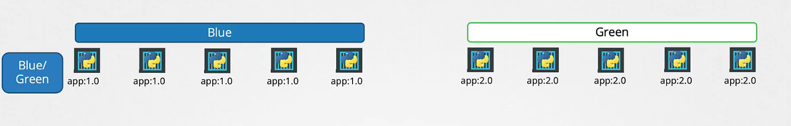
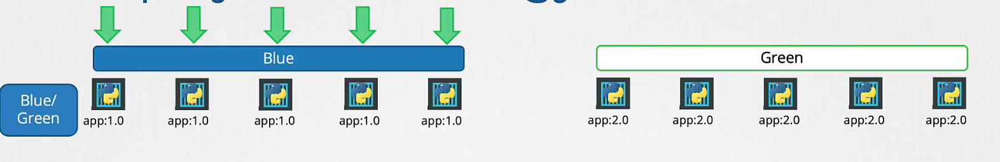
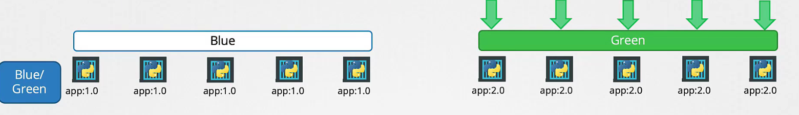
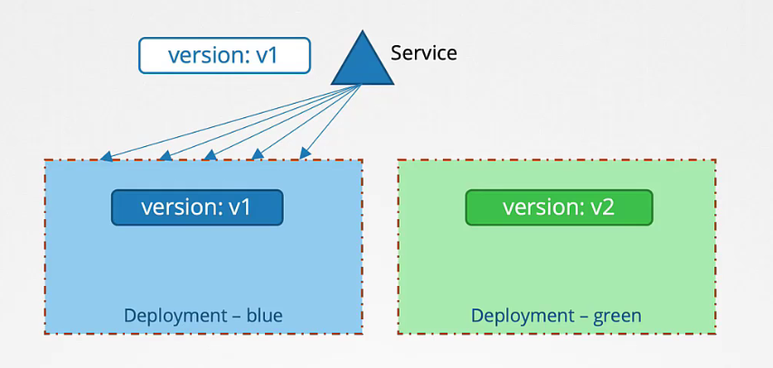
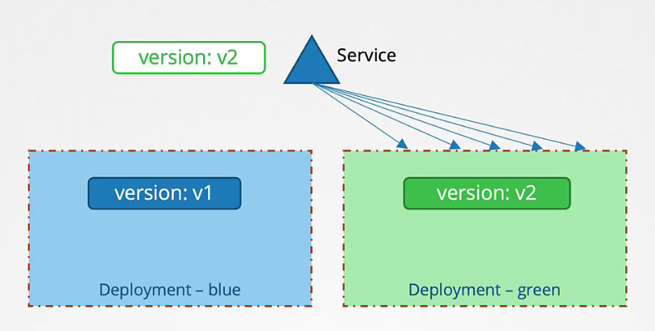
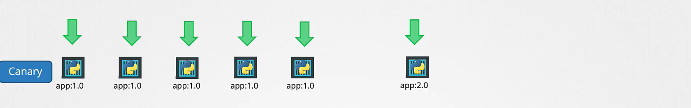
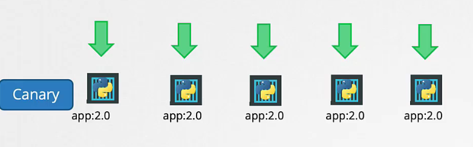
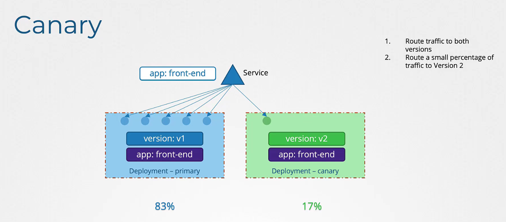

# Additional Deployment Strategies

## Blue Green strategy

A blue-green deployment is a method for updating your application with almost no downtime and less risk. In Kubernetes, you create two identical environments:

Blue Environment: This is the current, live version that your users are using.
Green Environment: This is the new version that you deploy and test.

When you are sure that the green environment works well, you switch the traffic from blue to green. This makes the update process fast and allows you to easily go back to the blue environment if something goes wrong.

We can implement this strategy using deployments and services.

### Why use Blue-Green deployment when you have Recreate or Rolling Update?

Even though the recreate and rolling update methods can update your application, blue-green deployment offers extra benefits:

- `Complete Isolation`: With blue-green deployment, you keep two separate environments. This means you can test the new version (green) without affecting the current live version (blue).
- `Instant Rollback`: If there is a problem with the green version, you can quickly switch back to the blue version because it is still running.
- `Minimal Downtime`: Although rolling updates reduce downtime, blue-green deployment allows you to make the switch at one clear moment. This is very useful in critical situations.
- `Better Testing`: Blue-green lets you test the new version in an environment that is very similar to production. This helps you be sure that everything works correctly before your users see it.

## Canary strategy

Canary deployment is a method of releasing a new version of your application gradually to a small subset of users before making it available to everyone.
Instead of updating all users at once, you deploy the new version (the "canary") alongside the existing version and only route a small percentage of traffic to it initially.

### How it works

You deploy the new version along with the current one, directing only a small fraction of traffic to the new version.

If the new version performs well, you slowly increase the traffic to it until eventually, it replaces the old version entirely.

### Benefits of Canary Deployment

- `Reduced risk`: Since only a small group of users is exposed to the new version at first, any problems are limited to that small subset.
- `Real world testing`: You get to test the new version under real user conditions without risking the experience of all your users.
- `Controlled rollout`: Gradually increasing the user base for the new version gives you better control over the update process.
- `Quick recovery`: With an easy rollback option, you can quickly switch back to the old version if something goes wrong.
