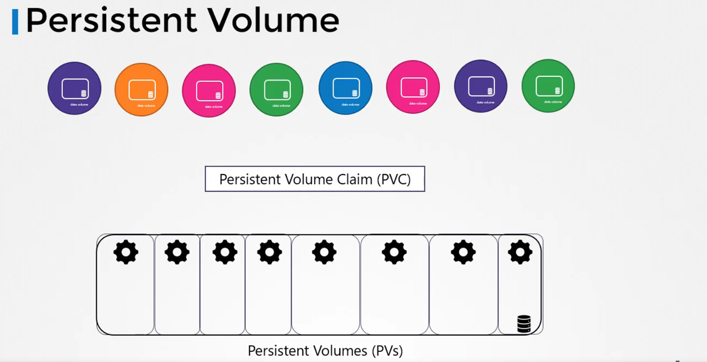

# Persistence

## Volumes

A Pod (or a docker container) is transient. -> the data is destroyed along with the container.
If we want to retain data we have to use volumes.

```yaml
apiVersion: v1
kind: Pod
metadata:
  name: random-number-generator
spec:
  containers:
    - image: alpine
      name: alpine
      command: ["/bin/sh", "-c"]
      args: ["shuf -i 0-100 -n 1 >> /opt/number.out;"]
      volumeMounts:
        - mountPath: /opt
          name: data-volume
  volumes:
    - name: data-volume
      hostPath:
        path: /data
        type: Directory
```

## Persistent Volumes



### Yaml

```yaml
apiVersion: v1
kind: PersistentVolume
metadata:
  name: <NAME>
spec:
  accessModes: [<SUPPORTED_MODES>]
  capacity:
    storage: <STORAGE>
  # Do not use in Production Environment
  hostPath:
    path: <PATH_ON_HOST>
  # Other options: azureDisk, azureFile, gcePersistentDisk
```

Example:

```yaml
apiVersion: v1
kind: PersistentVolume
metadata:
  name: pv-volume
spec:
  accessModes:
    - ReadWriteOnce
  capacity:
  hostPath:
    path: /tmp/data
```

The supported accessModes:

- ReadOnlyMany
- ReadWriteOnce
- ReadWriteMany

## Persistent Volume Claims

The User (Developer) creates persistent volume claims to use the storage.
Once it is created K8s binds the persistent volume to the claim based on the request and the properties set on the volume. Every persistent volume claim is bound to a single persistent volume.
There is a one-to-one relationship between the persistent volume and persistent volume claim.
If there is no matchin persistent volume then the claim remains in pending state.

```yaml
apiVersion: v1
kind: PersistentVolumeClaim
metadata:
  name: <NAME>
spec:
  accessModes: [<SUPPORTED_ACCESS_MODES>]
  resources:
    requests:
      storage: <STORAGE>
```

Example:

```yaml
apiVersion: v1
kind: PersistentVolumeClaim
metadata:
  name: pv-claim
spec:
  accessModes:
    - ReadWriteMany
  resources:
    requests:
      storage: 1Gi
```

### PersistentVolumeReclaimPolicy

Specifies what happens to the volume after deleting the persistent volume claim.

- `Retain`: the volume is not deleted but no other claim can use it. it must be deleted by an administrator
- `Delete`: the volume is deleted
- `Reclaim`: the data is deleted and an another claim can use the volume

## Using PVCs in Pods

Once you create a PVC use it in a POD definition file by specifying the PVC Claim name under persistentVolumeClaim section in the volumes section like this:

```yaml
apiVersion: v1
kind: Pod
metadata:
  name: mypod
spec:
  containers:
    - name: myfrontend
      image: nginx
      volumeMounts:
        - mountPath: "/var/www/html"
          name: mypd
  volumes:
    - name: mypd
      persistentVolumeClaim:
        claimName: myclaim
```

The same is true for ReplicaSets or Deployments. Add this to the pod template section of a Deployment on ReplicaSet.
