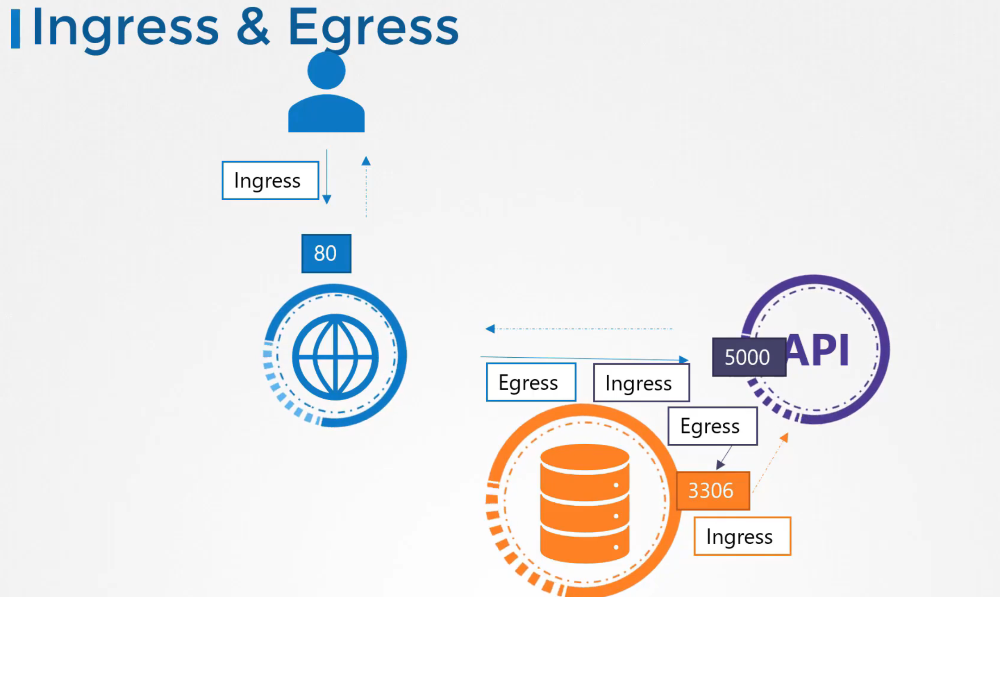
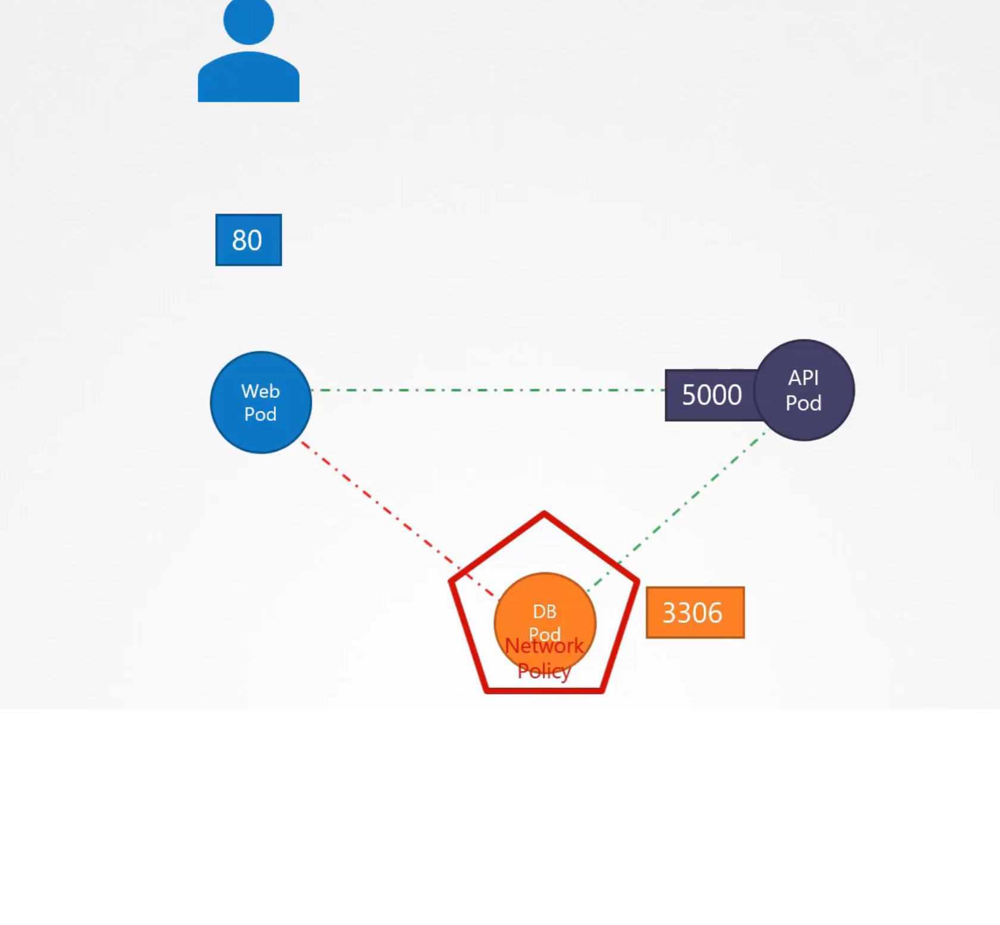
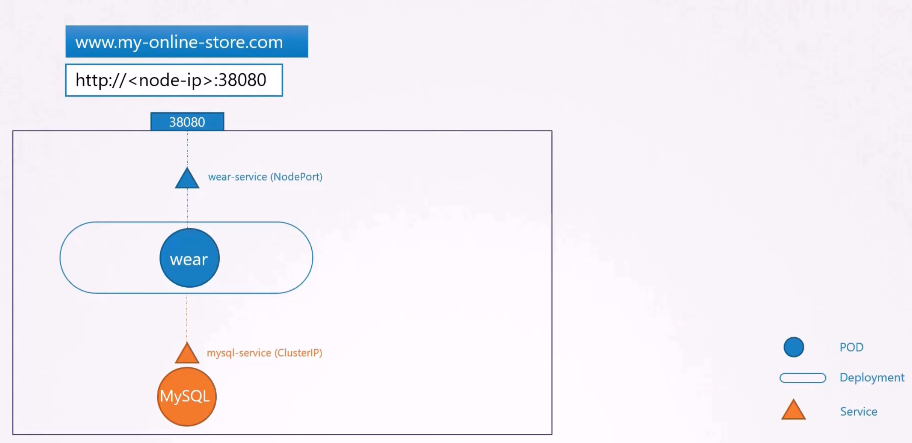
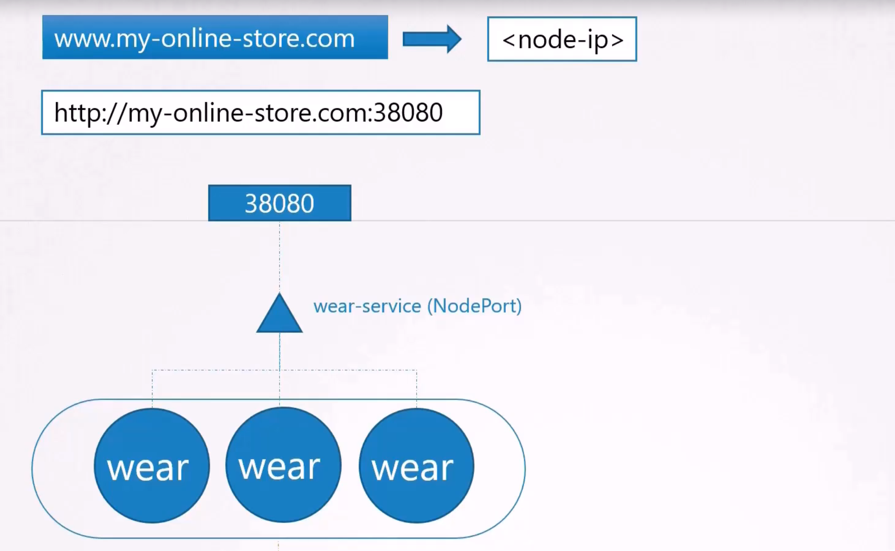
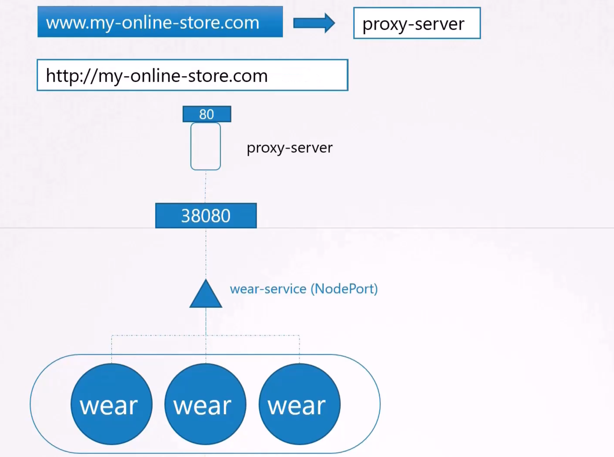
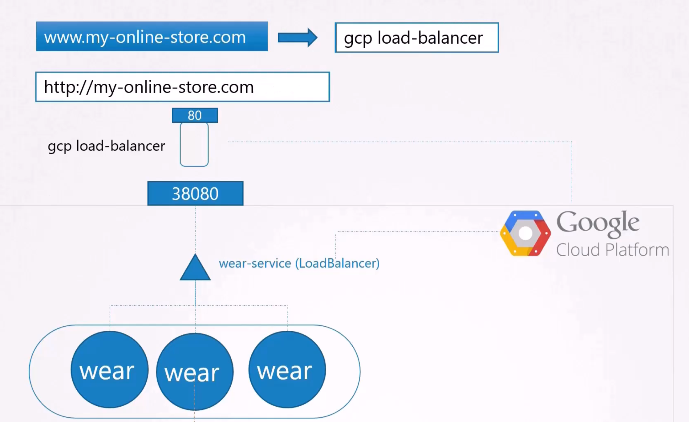
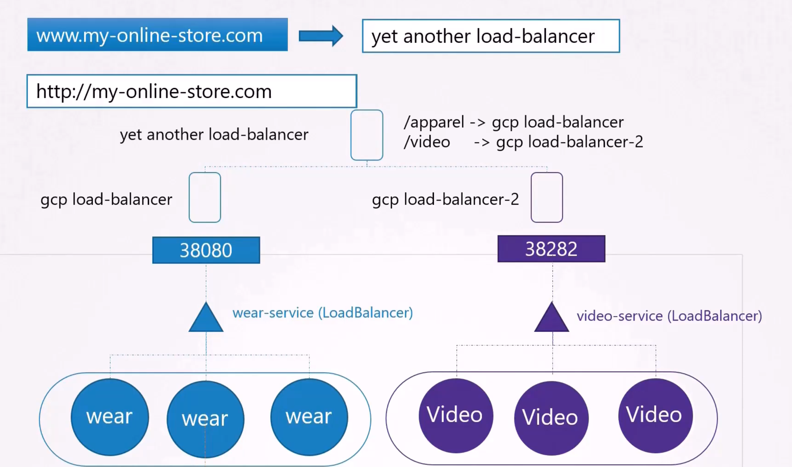
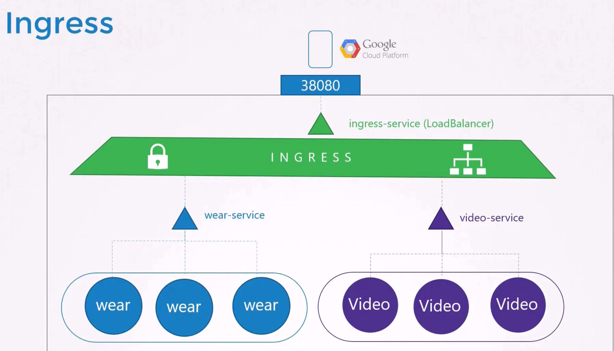
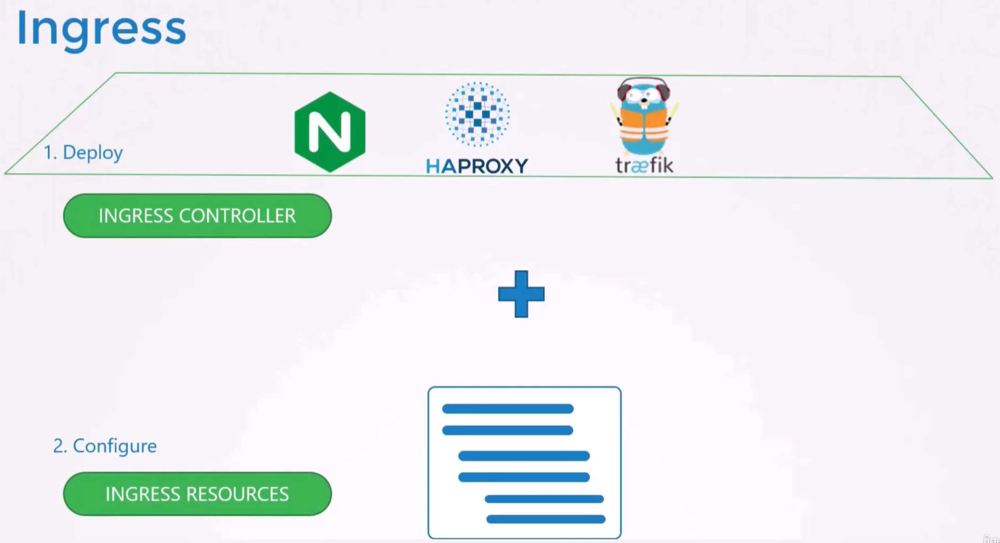

# Network policies

## Ingress and Egress

From the point of view of a webserver or database we have two types of traffic:

- Ingress when the server receives traffic (another service calls the server)
- Egress when the server sends traffic (the server calls a service)

### Example



## In Kubernetes

In kubernetes (by default) any pod or service is allowed to access any other pod or service (using the IP Address of the pod or the service name)\
A network policy is another object in kubernetes. It is linked to one or more pods.\
With network policies we can allow/restrict incoming or outgoing traffic to the pods.



## Commands

```shell
# List all network policies in default namespace
kubectl get networkpolicy
# List all network policies in default namespace (short form)
kubectl get netpol
# Get informations about a network policy
kubectl describe netpol <NETPOL_NAME>
# List all network policies in a specific namespace
kubectl get networkpolicy -n <NAMESPACE_NAME>
# Get informations about a network policy in a specific namespace
kubectl describe networkpolicy <NETPOL_NAME> -n <NAMESPACE_NAME>
```

## Creating network policies

### Using yaml files

```yaml
apiVersion: networking.k8s.io/v1
kind: NetworkPolicy
metadata:
  name: <NETPOL_NAME>
spec:
  podSelector:
    matchLabels:
      # Pod selector for network policy
      # You can use Ingress, Egress or both
  policyTypes:
    - Ingress
    - Egress
  ingress:
    - from:
        - podSelector:
            matchLabels:
              # Selector for incoming traffic
      ports:
        - protocol: <TARGET_PROTOCOL> #usually TCP
          port: <TARGET_PORT>
  egress:
    - to:
        - podSelector:
            matchLabels:
              # Selector for outgoing traffic
      ports:
        - protocol: <TARGET_PROTOCOL> #usually TCP
          port: <TARGET_PORT>
    # Only if we want dns name resolution and we have egress rules
    - to:
        - namespaceSelector:
            matchLabels:
              kubernetes.io/metadata.name: kube-system
      ports:
        - protocol: UDP
          port: 53
        - protocol: TCP
          port: 53
```

### In Minikube

By default the nework policies are ignored in minikube. We need to start our cluster using the following command `minikube start --cni=calico` if we want to use network policies.

# Ingress Controller and Ingress resources










## Ingress Controller

- The Ingress Controller is a specialized component in Kubernetes that manages incoming HTTP and HTTPS traffic, directing it to the appropriate services within the cluster.
- It is often deployed using third-party implementations, such as NGINX, Traefik, or HAProxy, to handle various routing needs.
- This controller operates based on configuration defined by Ingress Resources, ensuring effective traffic regulation and secure access.

## Ingress Resource

- An Ingress Resource is a declarative Kubernetes object that specifies how incoming HTTP and HTTPS traffic should be routed to different backend services.

### Creating Ingress Resource

Using yaml files

```yaml
apiVersion: networking.k8s.io/v1
kind: Ingress
metadata:
  creationTimestamp: null
  name: <INGRESS_RESOURCE_NAME>
  # Very important
  namespace: <NAMESPACE>
spec:
  rules:
    - http:
        paths:
          - backend:
              service:
                name: <NAME_OF_SERVICE>
                port:
                  number: <PORT_OF_SERVICE>
            path: <PATH>
            pathType: Exact
          - backend:
              service:
                name: <NAME_OF_SERVICE_2>
                port:
                  number: <PORT_OF_SERVICE_2>
            path: <PATH_2>
            pathType: Exact
```

Using imperative commands

```shell
kubectl create ingress NAME --rule=host/path=service:port[,tls[=secret]]  [options]
# Example
kubectl create ingress my-ingress-resource --rule="/wear=webapp-wear-svc:8888" --rule="/video=webapp-watch-svc:8888" -n app-space
```
