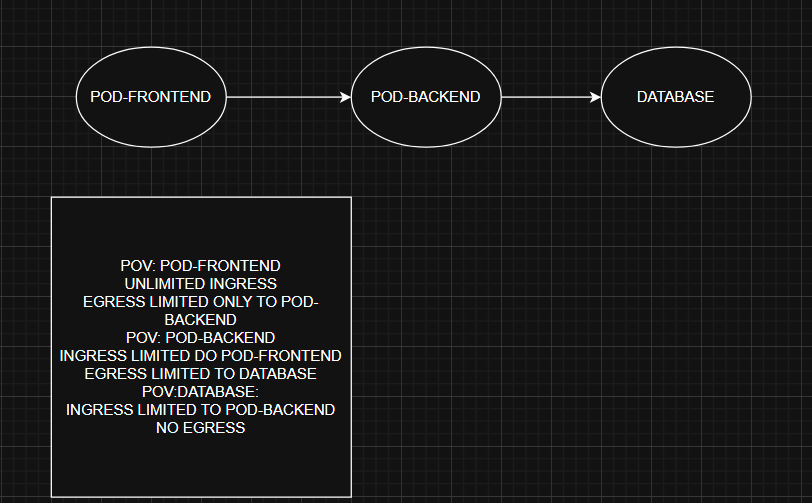

```shell
minikube start --cni=calico
minikube addons enable ingress
minikube delete --all --purge=true
minikube profile list
kubectl create -f .\demo_ingress.yaml
minikube service default-backend-svc -n app-space
minikube service webapp-watch-svc -n app-space
minikube service webapp-wear-svc -n app-space
minikube tunnel
kubectl create ingress my-ingress-resource --rule="/wear=webapp-wear-svc:8888" --rule="/video=webapp-watch-svc:8888" -n app-space
nginx.ingress.kubernetes.io/rewrite-target:
- --default-backend-service=app-space/default-backend-svc
```

# Network policies

\
2. Show\
3. Create network policies\
4. Show

# Ingress Controller / Resource
